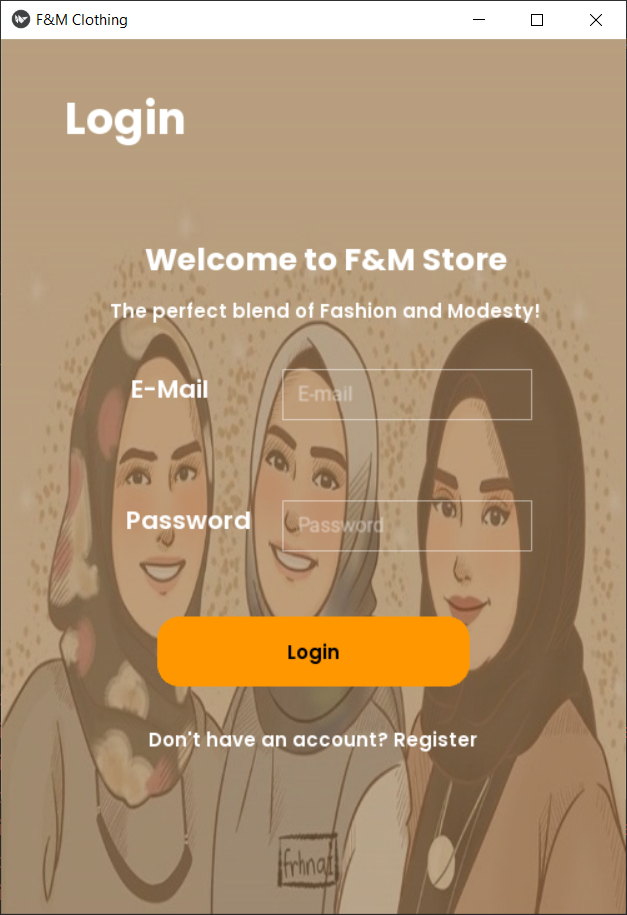
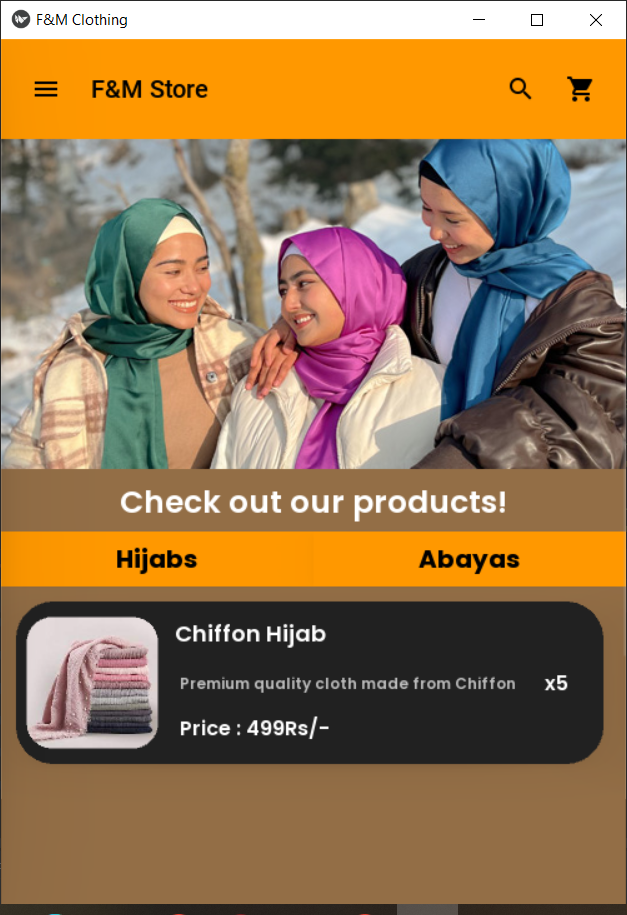
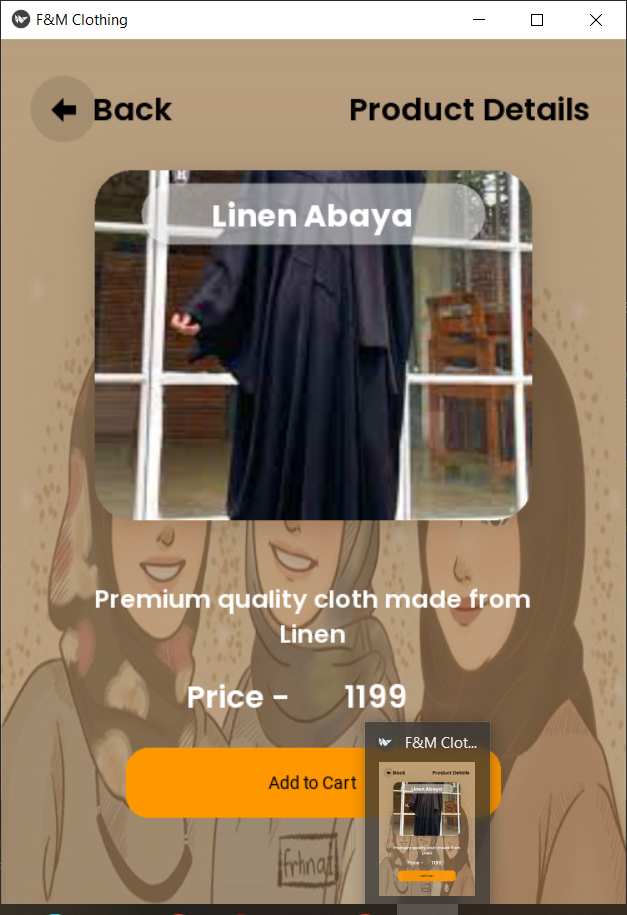
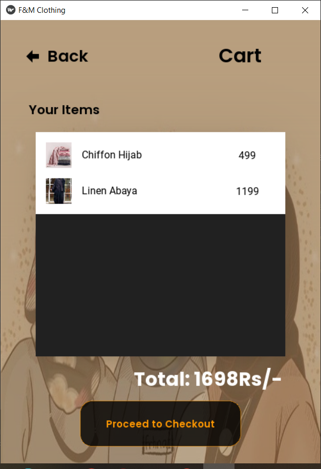
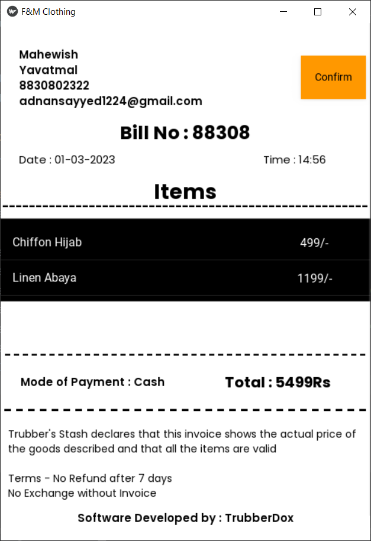

This is a simple E-commerce project that I made during my academic year.
The duration of the development of this project was only 2 weeks so it isn't, by any means, polished.

### Modules
## Login Screen
This is the first screen that pops up when you start the app.

## HomePage
<pre></pre>

## Single Product
<pre></pre>

## Cart
<pre></pre>

## Bill
<pre></pre>

### Extra Details
- This application has the ability to send bills over E-mail
- There is a section to view records

### How to Run
Simply run the main.py file and you're good to go

### Prerequisites
Kivy, MongoDB, Python should be installed on your machines
